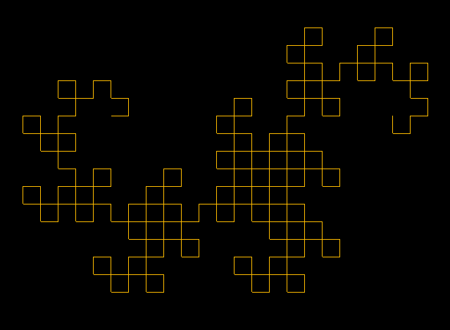

# CPSC 453: Assignment 1
**By: Dominic Choi**
## Controls:
- `Up Arrow`: Increase Depth
- `Down Arrow`: Decrease Depth
- `Left Arrow`: Change View
- `Right Arrow`: Change View

## Notes:
- I changed the name of the project to assignment-1.exe
- Depth starts at 1
- Max Depth is 8
- 0 Depth is the original shape (e.g. A Triangle for Koch Snowflake)
- Depth will not reset to 1 when changing views

## Views:
1. **Sierpinski Triangle**\
 

2. **Pythagoras Tree**\
 

3. **Koch Snowflake**\
 

4. **Dragon Curve**\

## Platform:
Windows 10

## Compiler:
g++.exe (Rev6, Built by MSYS2 project) 13.2.0 (probably; not really sure)

## Computer Specs:
- CPU: Ryzen 9 7950x3D
- GPU: AORUS GeForce RTX 3060 ELITE 12G
