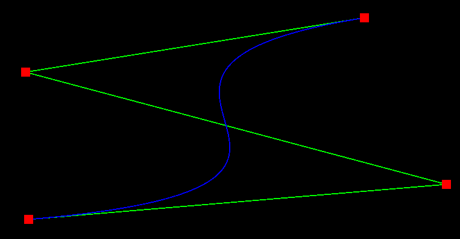
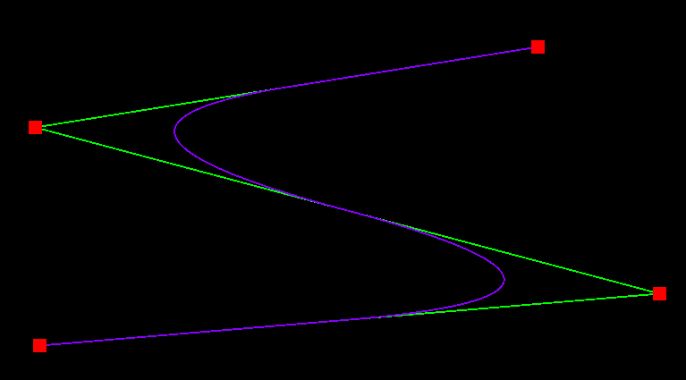

# CPSC 453: Assignment 3
**By: Dominic Choi**

## Controls
### 2D View Mode:
| Button | | Function |
| - | - | - |
| `R`           |                      | Clear all control points |
| `Left-Click`  | On a Control Point   | Selects the Point and can be dragged around |
| `Left-Click`  | Not on Control Point | Adds a point at cursor position |
| `Right-Click` | On a Control Point   | Deletes Control Point |

**Note:** you are able to modify the control points during the Surface of Revolution before going into 3D view

### 3D View Mode:
| Button | | Function |
| - | - | - |
| `R`           | | Reset Camera |
| `Left-Click`  | | Drag to move |
| `Scroll Up`   | | Zoom In      |
| `Scroll Down` | | Zoom Out     |

**In addition to the above controls, there are also options in the ImGui Panel**\
**Some options will appear and disappear depending on the scene**

## Images of my stuff working :D
### Bezier

### B-Spline

### Surface of Revolution
#### 2D View
.png>)
#### 3D Perspective
.png>)

### Tensor Product Surface
#### Handout
.png>)

#### Custom
.png>)

## Platform:
Windows 10

## Compiler:
g++.exe (Rev6, Built by MSYS2 project) 13.2.0 (probably; not really sure)

## Computer Specs:
- CPU: Ryzen 9 7950x3D
- GPU: AORUS GeForce RTX 3060 ELITE 12G
